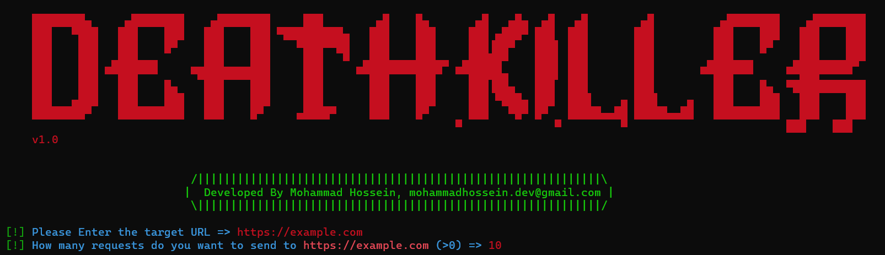

# DeathKiller
DeathKiller is a tool that can simply does a DOS attack to a Website, written in Python. We'll update and add some features to make it better, as soon as possible

# How to use :

This tool needs these packages :

requests  
colorama

To install these two run the following in your cmd/terminal :  

pip install requests  
pip install colorama  

or if in linux didn't work try these :  

pip3 install requests  
pip3 install colorama  

 
 
 

A View of the tool :  

Good luck!
